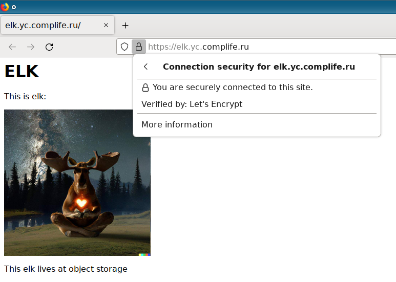

# Домашняя работа по занятию 15.3 "Безопасность в облачных провайдерах"

---
> ## Задание 1. Яндекс.Облако (обязательное к выполнению)
> 1. С помощью ключа в KMS необходимо зашифровать содержимое бакета:
> - Создать ключ в KMS,
> - С помощью ключа зашифровать содержимое бакета, созданного ранее.
> 2. (Выполняется НЕ в terraform) *Создать статический сайт в Object Storage c собственным публичным адресом и сделать доступным по HTTPS
> - Создать сертификат,
> - Создать статическую страницу в Object Storage и применить сертификат HTTPS,
> - В качестве результата предоставить скриншот на страницу с сертификатом в заголовке ("замочек").

[Ресурсы терраформа](yc)

Применяем конфигурацию:
```
Apply complete! Resources: 11 added, 0 changed, 0 destroyed.

Outputs:

access-key = <sensitive>
elk-picture = {
  "bucket elk.yc.complife.ru" = "https://storage.yandexcloud.net/elk.yc.complife.ru/elk.jpg"
  "bucket netology-15-encrypted" = "https://storage.yandexcloud.net/netology-15-encrypted/elk.jpg"
}
site = "elk.yc.complife.ru"
```

Проверяем картинку в зашифрованном S3-бакете:
```
$ cat ../elk.jpg |md5sum 
7ea8db72555db4cc1da3299ca5304732  -

[mak@mak-ws yc]$ curl -s https://storage.yandexcloud.net/netology-15-encrypted/elk.jpg |md5sum 
1d84591b421dcdd0ab3b120b632450ca  -
```
Ой чо такое, md5 сумма не сходится!! 

```
$ curl -D-  -s https://storage.yandexcloud.net/netology-15-encrypted/elk.jpg
HTTP/2 403 
server: nginx
date: Sat, 30 Apr 2022 05:07:25 GMT
content-type: application/xml; charset=UTF-8
content-length: 201
x-amz-request-id: 9a59cfa0491f5616

<?xml version="1.0" encoding="UTF-8"?>
<Error><Code>AccessDenied</Code><Message>Access Denied</Message><Resource>/netology-15-encrypted/elk.jpg</Resource><RequestId>9a59cfa0491f5616</RequestId></Error>
```
Зашифрованно, кому попало нельзя. Хорошо, мы не кто попало, настроим для Яндекса cli-утилиту aws и получим секретный URL:
```
KEY_NAME=access-key
KEY_INFO=$(terraform output -json $KEY_NAME)
export AWS_ACCESS_KEY_ID=$(echo $KEY_INFO |jq -r '.access_key')
export AWS_SECRET_ACCESS_KEY=$(echo $KEY_INFO |jq -r '.secret_key')
export AWS_DEFAULT_REGION=ru-central1

SECRET_URL=$(aws --endpoint-url=https://storage.yandexcloud.net/ s3 presign s3://netology-15-encrypted/elk.jpg)

curl -s "$SECRET_URL" |md5sum 
7ea8db72555db4cc1da3299ca5304732  -
```
Вот, теперь сходится.

Далее, пробуем созданный статический сайт:
```
$ curl -L -s elk.yc.complife.ru
<html><body><h1>ELK</h1><p>This is elk:</p>
<a href='elk.jpg'></a>
<p>This elk lives at object storage</p></body></html>
```

И замочек в браузере:  



--- 
> ## Задание 2*. AWS (необязательное к выполнению)

> 1. С помощью роли IAM записать файлы ЕС2 в S3-бакет:
> - Создать роль в IAM для возможности записи в S3 бакет;
> - Применить роль к ЕС2-инстансу;
> - С помощью бутстрап скрипта записать в бакет файл web-страницы.

Это мы запишем, но `index.html` всё равно будет терраформ делать, а то непустой бакет потом удалить сложно будет
 
> 2. Организация шифрования содержимого S3-бакета:
> - Используя конфигурации, выполненные в рамках ДЗ на предыдущем занятии, добавить к созданному ранее bucket S3 возможность шифрования Server-Side, используя общий ключ;
> - Включить шифрование SSE-S3 bucket S3 для шифрования всех вновь добавляемых объектов в данный bucket.
> 3. *Создание сертификата SSL и применение его к ALB:
> - Создать сертификат с подтверждением по email;
> - Сделать запись в Route53 на собственный поддомен, указав адрес LB;
> - Применить к HTTPS запросам на LB созданный ранее сертификат.

[Ресурсы терраформа](aws)

Применяем конфигурацию:
```
Apply complete! Resources: 38 added, 0 changed, 0 destroyed.

Outputs:

LB_addr = "web-253263607.eu-central-1.elb.amazonaws.com"
encrypted_bucket_link = "https://netology-15-encrypted.s3.amazonaws.com/elk.jpg"
site_bucket_link = "https://netology-15-site.s3.amazonaws.com/elk.jpg"
site_dns_record = "elk.aws.complife.ru"
static_website_link = "netology-15-site.s3-website.eu-central-1.amazonaws.com"
vm_public_ip = "54.93.202.49"
zone_ns_servers = tolist([
  "ns-1269.awsdns-30.org",
  "ns-1572.awsdns-04.co.uk",
  "ns-51.awsdns-06.com",
  "ns-807.awsdns-36.net",
])
```

Проверяем доступность сайта, статический website в s3 bucket:
```
$ curl -s netology-15-site.s3-website.eu-central-1.amazonaws.com |head -1
<html><body><h1>ELK</h1><p>This is elk:</p>
```

С публичного адреса EC2-инстанса:
```
$ curl -s 54.93.202.49 |head -1
<html><body><h1>ELK</h1><p>This is elk:</p>
```

Через LoadBalancer:
```
$ curl -s web-253263607.eu-central-1.elb.amazonaws.com |head -1
<html><body><h1>ELK</h1><p>This is elk:</p>
```

Через LoadBalancer со своим DNS-именем и замочком в браузере:
```
$ curl -s https://elk.aws.complife.ru |head -1
<html><body><h1>ELK</h1><p>This is elk:</p>
```

Проверяем картинку из зашифрованного бакета:
```
 curl -s https://netology-15-encrypted.s3.eu-central-1.amazonaws.com/elk.jpg
<?xml version="1.0" encoding="UTF-8"?>
<Error><Code>InvalidArgument</Code><Message>Requests specifying Server Side Encryption with AWS KMS managed keys require AWS Signature Version 4.</Message><ArgumentName>Authorization</ArgumentName><ArgumentValue>null</ArgumentValue><RequestId>VJXJSJV8GFTVQPVR</RequestId><HostId>38IMyp5gUI3dt8EArZZZ2TRJiGNRQQhIO9u/CTev+Op+0v3frsmOnNPNWZ5kTAJireZ5IbyY0lQ=</HostId></Error>
```

И добываем её через секретный URL:
```
$ SECRET_URL=$(aws s3 presign s3://netology-15-encrypted/elk.jpg)
$ curl -s "$SECRET_URL" |md5sum 
7ea8db72555db4cc1da3299ca5304732  -
$ cat ../elk.jpg |md5sum 
7ea8db72555db4cc1da3299ca5304732  -
```
