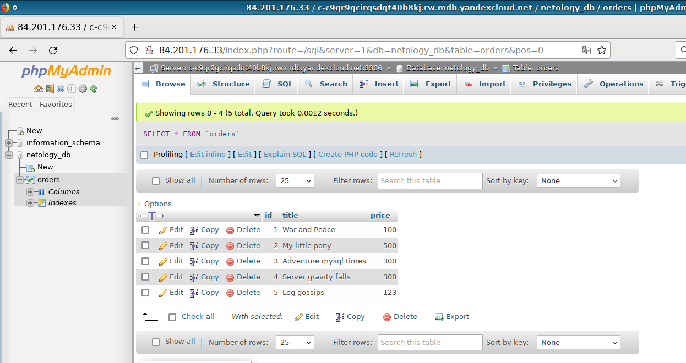

# Домашняя работа по занятию 15.4 "Кластеры. Ресурсы под управлением облачных провайдеров"

---
> ## Задание 1. Яндекс.Облако (обязательное к выполнению)

[Ресурсы терраформа](yc)

```
Apply complete! Resources: 17 added, 0 changed, 0 destroyed.

Outputs:

db_cluster_hosts_fqdn = tolist([
  "rc1a-izui0v3pdm9xabkl.mdb.yandexcloud.net",
  "rc1b-z6ga8v02pmqh7cut.mdb.yandexcloud.net",
  "rc1c-5hlwief0y6j0m9sc.mdb.yandexcloud.net",
])
db_cluster_master = "c-c9qr9gcirqsdqt40b8kj.rw.mdb.yandexcloud.net"
db_creds = "netology_db -u db_admin -p'AdmIn_pa$sw0rd'"
k8s_cluster_id = "catqrie4oi2j2eg63sk2"
k8s_cluster_name = "netology-cluster"
k8s_endpoint = "https://51.250.87.40"
test_vm_ip = "51.250.88.210"
```


> 1. Настроить с помощью Terraform кластер баз данных MySQL:

Создадим так же тестовую виртуалку для тестирования кластера mysql, который размещается в приватной сети.   
Проверяем подключение к мастеру и текущую базу данных:
```
$ DB_CREDS=$(terraform output -raw db_creds)
$ TEST_VM=$(terraform output -raw test_vm_ip)
$ DB_HOSTS=$(terraform output -json db_cluster_hosts_fqdn |jq -r '.[]')
$ DB_MASTER_HOST=$(terraform output -raw db_cluster_master)

$ echo "select database();" |ssh cloud-user@$TEST_VM mysql -N -h $DB_MASTER_HOST $DB_CREDS 2>/dev/null 
netology_db
```

Зальём в базу данных тестовый SQL-дамп с занятия `06-db-03-mysql`.  
Убедимся, что репликация работает, и мы можем выполнить `SELECT` на любом хосте кластера:
```
$ SQL_DUMP=https://raw.githubusercontent.com/netology-code/virt-homeworks/master/06-db-03-mysql/test_data/test_dump.sql
$ curl -s $SQL_DUMP |ssh cloud-user@$TEST_VM mysql -N -h $DB_MASTER_HOST $DB_CREDS 2>/dev/null

$ for DB_HOST in $DB_HOSTS; do \
    echo "select title from orders where price=100" | \
    ssh cloud-user@$TEST_VM mysql -N -h $DB_HOST $DB_CREDS 2>/dev/null; \
  done
War and Peace
War and Peace
War and Peace
```

---
> 2. Настроить с помощью Terraform кластер Kubernetes
> - Создать группу узлов состояющую из 3 машин с автомасштабированием до 6
 
По хорошему, если уж мы разместили мастер в трёх разных зонах, нам надо бы разместить и 
рабочие ноды тоже в разных зонах, для отказоустойчивости. Теоретически, для этого есть блок `allocation_policy`, который 
может содержать повторяющееся поле `location` для разных зон. Но, как оказалось, несколько полей `location` 
несовместимо с требованияем из задания создать автомасштабируемую группу машин:    
`allocation_policy.locations: auto scale node groups can have only one location`

Поэтому мы немного извратимся в учебных целях, создав три группы машин в разных зонах, и каждая будет 
автомасштабироваться в пределах 1-2 машин, что помноженное на три зоны будет соответствовать требованию 3-6 in total. 

> - Подключиться к кластеру с помощью `kubectl`

Для этого нам нужно импортировать себе в конфиг детали подключения к кластеру:
```
$ yc managed-kubernetes cluster get-credentials --external $(terraform output -raw k8s_cluster_id)

Context 'yc-netology-cluster' was added as default to kubeconfig '/home/mak/.kube/config'.
Check connection to cluster using 'kubectl cluster-info --kubeconfig /home/mak/.kube/config'.
```

Проверим наши рабочие ноды, и где они разместились:
```
$ kubectl get nodes
NAME                        STATUS   ROLES    AGE   VERSION
cl1aifklp9tl81hg3prg-efan   Ready    <none>   60m   v1.21.5
cl1ni2lji04upmjnsdlf-ipic   Ready    <none>   61m   v1.21.5
cl1se56dah3qmcfp3ef7-opag   Ready    <none>   61m   v1.21.5

$ kubectl get nodes  -o json |jq '.items[].metadata.labels."topology.kubernetes.io/zone"'
"ru-central1-b"
"ru-central1-c"
"ru-central1-a"
```

> - *Запустить микросервис phpmyadmin и подключиться к БД, созданной ранее
> - *Создать сервис типы Load Balancer и подключиться к phpmyadmin. Предоставить скриншот с публичным адресом и подключением к БД

Добавим репозитарий с хелм-чартом, установим приложение с LoadBalancer и узнаем URL для подключения:
```
$ helm repo add bitnami https://charts.bitnami.com/bitnami
"bitnami" has been added to your repositories

$ helm install -n phpmyadmin --create-namespace phpmyadmin bitnami/phpmyadmin --set db.host=$DB_MASTER_HOST --set service.type=LoadBalancer
NAME: phpmyadmin
LAST DEPLOYED: Wed May 11 19:41:43 2022
NAMESPACE: phpmyadmin
STATUS: deployed
REVISION: 1
TEST SUITE: None
NOTES:
CHART NAME: phpmyadmin
CHART VERSION: 10.0.1
APP VERSION: 5.1.3

** Please be patient while the chart is being deployed **

1. Get the application URL by running these commands:

  NOTE: It may take a few minutes for the LoadBalancer IP to be available.
        Watch the status with: 'kubectl get svc --namespace phpmyadmin -w phpmyadmin'

  export SERVICE_IP=$(kubectl get svc --namespace phpmyadmin phpmyadmin --template "{{ range (index .status.loadBalancer.ingress 0) }}{{ . }}{{ end }}")
  echo "phpMyAdmin URL: http://$SERVICE_IP/"

2. How to log in

phpMyAdmin has been configured to connect to a database in c-c9qr9gcirqsdqt40b8kj.rw.mdb.yandexcloud.netwith port 3306 
Please login using a database username and password.


$   export SERVICE_IP=$(kubectl get svc --namespace phpmyadmin phpmyadmin --template "{{ range (index .status.loadBalancer.ingress 0) }}{{ . }}{{ end }}")
$   echo "phpMyAdmin URL: http://$SERVICE_IP/"
phpMyAdmin URL: http://84.201.176.33/
```



--- 
> ## Задание 2. Вариант с AWS (необязательное к выполнению)

Увы, не успел за разумный срок. Только кластер RDS сделал, это сожрало какое-то ужасное количество времени. Может, позже доделаю. 
